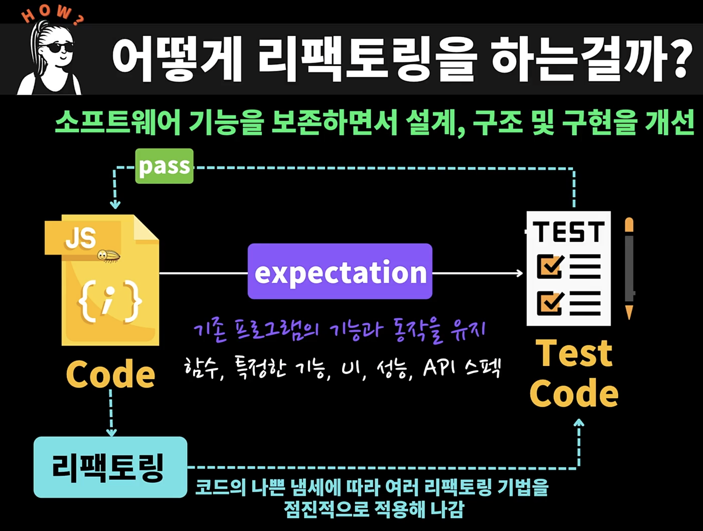

## 2.1 리팩토링이란 무엇인가 ?

- 코드를 깨끗하게 만드는 작업이다.

- 결과, 행동의 변경 없이 코드의 구조를 재조정

  - 소프트웨어 기능을 보존하면서(변경하지 않으면서) 설계, 구조 및 구현을 개선

  - 여기서 코드란 함수, 모듈 또는 소프트웨어 전체적인 설계가 될 수 있다

- 기존의 코드를 개선해나가는 것을 리팩토링이라고 한다

### 리팩토링의 목표

- 복잡성 감소

- 가독성 향상

- 유지 보수성을 개선

  - 버그가 생겼을 때 손 쉽게 다른 사람의 코드를 수정할 수 있게

- 확장성을 높임

  - 새로운 기능을 추가할 때 짧은 시간안에 기능을 추가할 수 있다

- 즉, 리팩토링을 통해서 더 단순하고, 깔끔하고 표현력이 뛰어난 코드, 내부 아키텍처 / 객체 모델을 만드는 것이다.

### 리팩토링을 할 때 절대 하면 안되는 것

- 기능 변경 / 추가

  - 리팩토링은 코디를 개선해 나가는 과정일 뿐 새로운 기능을 추가, 변경하면 안된다

- 버그 수정

  - 리팩토링하면서 버그가 발견되도 수정하면 안된다

- 성능 개선

  - 리팩토링을 통해서 성능이 개선될 수 있지만

  - 성능 개선을 위해서 리팩토링을 하지는 않는다

- 버전 업데이트

  - 라이브러리나 dependency의 버전 업데이트 하지 않는다

### 리팩토링 (Refactoring)

- 리팩터링 [명사]

  - 소프트웨어의 겉보기 동작은 그대로 유지한 채, 코드를 이해하고 수정하기 쉽도록 **내부 구조를 변경하는 기법**

- 리팩터링(하다) [동사]

  - 소프트웨어의 겉보기 동작은 그대로 유지한 채, 여러가지 **리팩터링 기법을 적용해서** 소프트웨어를 재구성하다

---

## 2.2 리팩토링이 왜 필요할까 ?

- 왜 리팩토링을 해야하는 걸까 ?

  - = 왜 코드를 개선하는 걸까 ?

  - 개발 초기 단계부터 완벽한 코드 / 시스템 설계의 어려움

  - 프로그램의 요구사항은 꾸준히 변경됨 (기능 추가 / 변경)

    - 그렇기 때문에 처음부터 완벽한 프로그램을 만들 수 없다.

  - 더럽고 복잡한 코드는 이해하기 어려움

  - 예상하지 못한 에러가 발생하기 쉬움

  - 복잡한 코드의 유지보수는 어려움 (수정 시간이 오래걸림)

    - 내부적으로 퀄리티가 높은 소프트웨어는 초기에는 기능 추가하는데 느릴 수 있지만, 나중에 시간이 지나면서 더 빠르게 기능을 구현할 수 있다

### 1. 소프트웨어 설계가 좋아짐

- 모든 코드가 언제나 고유한 일을 수행함을 보장함

- 이해해야 할 코드의 양이 작고, 실수 없이 수정할 수 있음

### 2. 소프트웨어를 이해하기 쉬워짐

- 코드의 목적이 잘 드러나게, 의도를 더 명확하게 표현

- 코드가 잘 읽힘, 가독성이 좋아짐

### 3. 버그를 쉽게 찾을 수 있음

- 코드가 하는 일을 깊이 있게 빠르게 파악할 수 있음

### 4. 프로그래밍 속도를 높일 수 있음

- 내부 설계가 잘 된 소프트웨어는 새로운 기능을 추가할 지점을 빠르게 찾음

- 작은 일부의 코드만 이해하여 빠르게 수정이 가능

- 디버깅이 쉬움

- 새로운 기능을 손쉽게 추가

---

## 2.3 리팩토링 어떻게 해야하나 ?

- 리팩토링

  - 소프트웨어 기능을 보존하면서 설계, 구조 및 구현을 개선

- 금지

  - 기능 변경 / 추가

  - 버그 수정

  - 성능 개선

  - 버전 업데이트

- 기존의 기능을 유지하면서 코드자체만 개선해야 한다

### 우리가 지켜야할 절차가 있다 (어떻게 리팩토링 해야 되는지 )

- Code - expectation(기존 프로그램의 기능과 동작을 유지) → TestCode

- 코드를 개선하고 싶다면 기존에서 동작하는 코드를 유지할 수 있도록 한다.

  - 그리고 유지한다는 것을 쉽게 보장할 수 있도록 기존의 코드에 대한 테스트 코드를 가지고 있어야 한다

- 테스트 코드를 통해서 기존 프로그램의 기능과 동작을 테스트할 수 있도록 만들어 두어야 한다

  - 함수, 특정한 기능, UI, 성능, API 스펙등을 잘 테스트 해서 예상하는 대로 잘 동작할 수 있는 테스트 코드를 만들어두어야 한다

- 그래서 기존의 코드를 리팩토링한다

- 코드의 나쁜 냄새에 따라 여러 리팩토링 기법을 점진적으로 적용해 나간다.

- 그리고 이 때 테스트 코드가 정상적으로 작동하는지 확인을 해주면서 코드를 수정해나간다.

- 중요한 것은 리팩토링 할 때 기존의 기능을 유지하고, 리팩토링 하는 동안 버그를 발견해도 버그는 그대로 두고 리팩토링이 끝난 후에 그 버그에 대해서 수정을 해준다

---

## 2.4 언제 리팩토링 해야 하나 ?

- 수시로! 해야 한다

  - 리팩토링은 개발을 해나가면서 수시로 해야한다

### 프로젝트 시작 단계

- 기능 구현을 위한 코드를 작성

- 좋은 디자인 패턴으로 깔끔하게 코드를 작성해 나가는게 좋다

  - → 이 때 그 기능에 해당하는 테스트 코드도 함께 작성해준다.

- 테스트를 하기 위해서 리팩토링을 하는 경우도 있다

- 즉, 테스트를 위한 코드를 작성하는 과정에서 코드가 개선되는 것이다.

- 3의 법칙

  - 비슷한 일을 세번째 하게 되면 리팩토링 한다.

- 코드리뷰

  - 코드리뷰를 하게 되는데 코드를 이해하기 쉽게 만든다

  - 코드리뷰 자체가 좋은 문서화가 된다

- 기능 추가

  - 기능을 쉽게 추가하게 만들기

    - 기존의 테스트 코드가 있으니까 이를 리팩토링해서 확장성을 높일 수 있다.

  - 재사용성, 모듈성도 높일 수 있다

### 프로젝트 유지보수 단계

- 버그 수정

  - 버그를 검증할 수 있는 테스트 코드 작성

  - 어떤 부분에서 버그가 생기는지, 실패하는지 확인을 하고

  - 코드를 이해하기 쉽게, 변경하기 쉽게 변경 리팩토링한다

  - 이를 통해 버그를 쉽게 수정할 수 있다

- 가눙 추가, 다른 라이브러리의 디펜던시 업데이트 하거나 마이그레이션하는 경우

  - 기존의 기능들에 대한 테스트가 있는지 확인

  - 만약 없다면 기존의 기능이 잘 동작하는 것을 보장할 수 있는 테스트 코드를 작성한다

  - 코드를 이해하기 쉽게, 변경하기 쉽게 변경 리팩토링한다

  - 이를 통해 기능을 쉽게 추가할 수 있다.

- 프로젝트 유지보수 단계라면, 모든 부분이 아니더라도 내가 필요한 부분에 테스트 코드를 먼저 작성한 다음에 코드를 개선한 다음에 기능을 추가해준다.

### 오래된 프로젝트

- 테스트 코드가 하나도 없는 경우

  - 버그 수정 및 기능 추가시에만

    - 프로젝트 유지 보수 단계처럼 수정이 필요한 모듈, 코드 한정적으로 테스트 추가하고

    - 그 부분이 되는지 검증한 다음에

    - 그 다음에 리팩토링 한다.

    - 그 다음에 코드 수정 또는 기능 추가한다.

- 예전에 작성된 코드는 스파게티 코드처럼 복잡하고 테스트 코드를 작성하는 것이 어려울 때도 있다.

- 그렇기 때문에 때로는 새로운 코드를 작성하는 것이 빠를 수도 있다

---

## 2.5 리팩토링의 중요한 포인트

- 리팩토링

  - 코드를 깨끗하게 만드는 작업

  - 소프트웨어의 결과 / 행동 변경 없이 코드의 구조를 재조정

  - 소프트웨어 기능을 보존하면서 설계, 구조 및 구현을 개선

- 소프트웨어 기능 보존, 확신을 위해서, 즉 기능을 보장하기 위해서 테스트 코드를 작성한다

- “무결점 클린코드, 완벽한 설계는 존재하지 않는다"를 인정!

  - 처음에는 좋은 디자인 패턴으로 코드를 깔끔하게 작성하되

  - 너무 완벽한 코드를 작성하려고 하기 보다는

  - 기능 구현을 위한 코드를 작성한다

  - 그리고 그걸 검증하는 테스트 코드를 작성하고

  - 추후에 리팩토링을 통해서 코드를 개선해 나간다

- 그리고 비슷한 일을 3번 하게 되면 3의 법칙에 따라 리팩토링한다

  - 3의 법칙

    - 비슷한 일을 세번째 하게 되면 재사용할 수 있도록 리팩토링 한다.

### 야그니 (YAGNI)

- You Ain’t Gonna Need It

  - 깨끗하게

  - 변경이 쉽게

  - 유지보수 용이

  - 하게 코드를 작성하는 것은 중요하지만

  - 지금 이 기능이 필요하지 않는 기능에 집착해서 코드를 지나치게 복잡하게 만든다거나

  - 사용하지 않는 기능을 구현하거나

  - 지나치게 미래지향적으로 소프트웨어를 작성해서 복잡성을 높이지 않는다

  - 필요할 때 언제든지 리팩토링을 해서 코드를 개선해나갈 수 있다.

- 그렇다고 나중에 리팩토링할 것이라는 생각으로 코드를 막 작성하는 것이 아니라,

- 처음부터 좋은 습관으로 코드를 작성하는 것이 중요하다

- 다만 너무 지나치게 클린코드, 클린 아키텍처를 지향하면서 오버엔지니어링 하지 말 것
