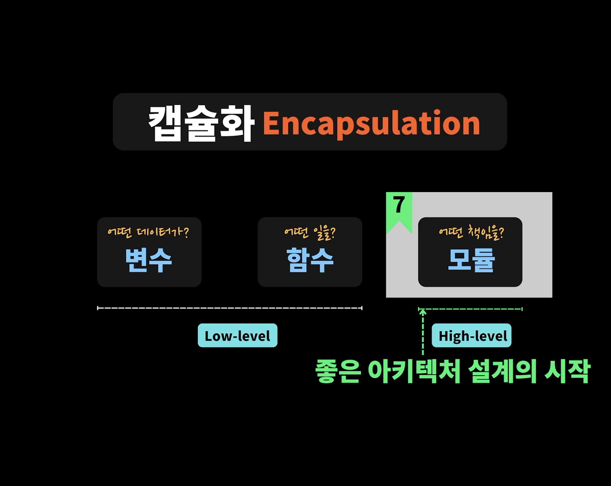
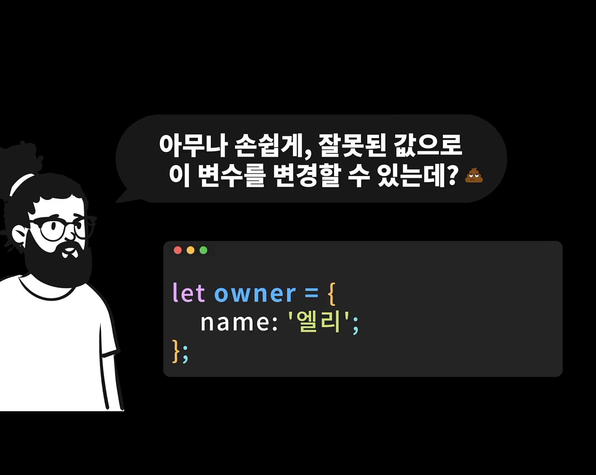
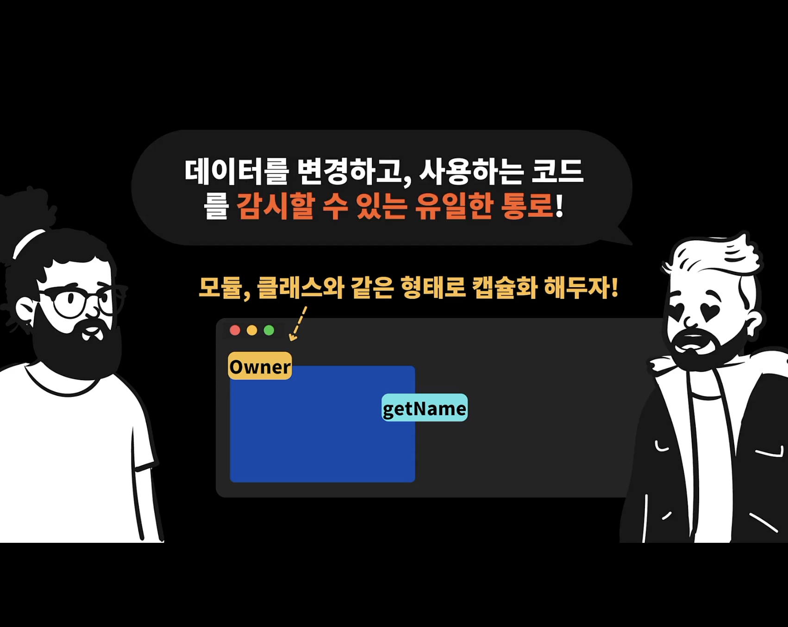
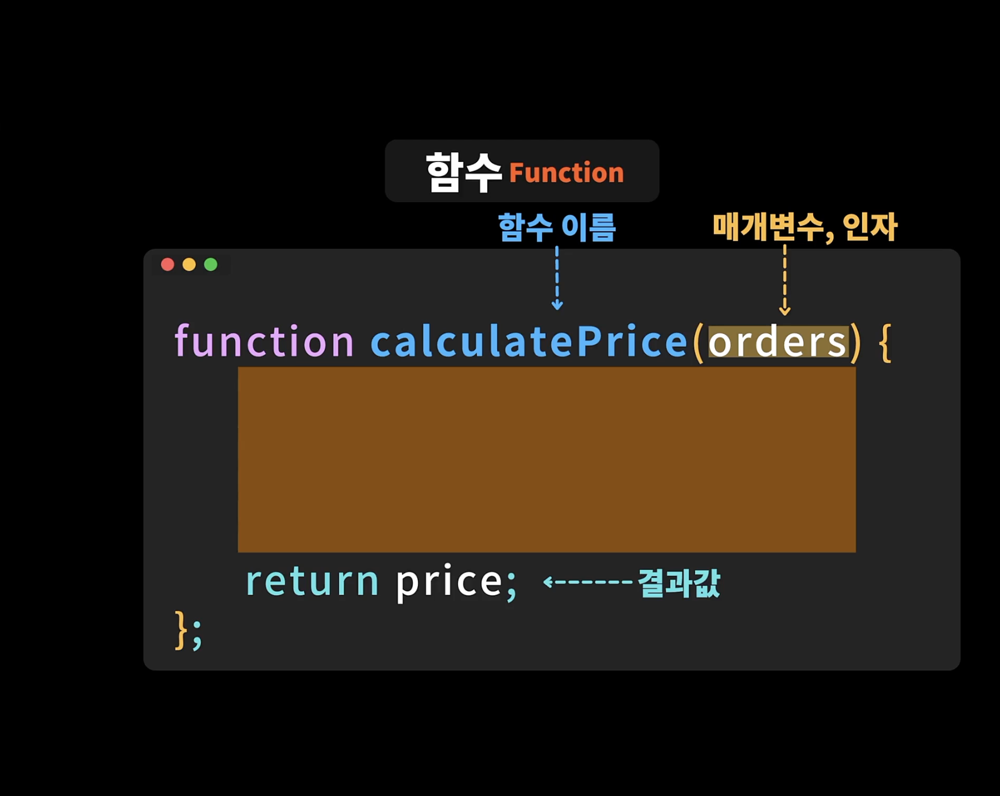
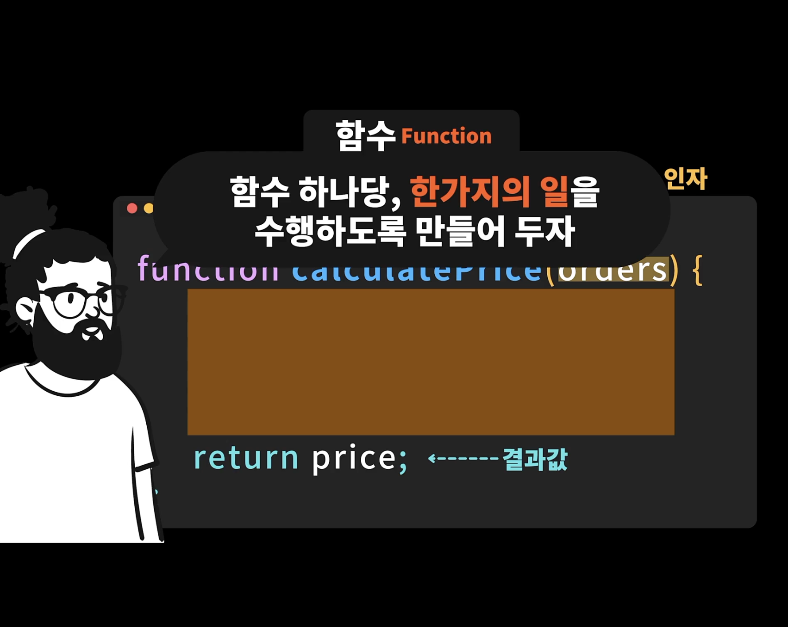
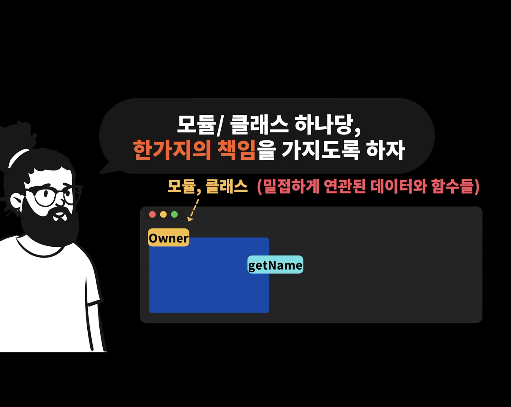
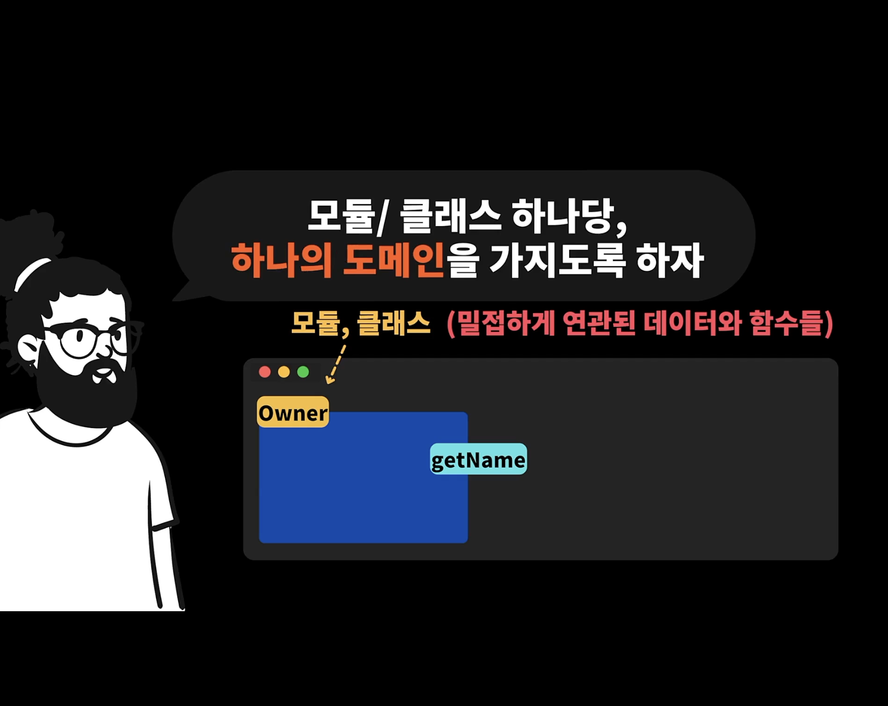

## 7.1 챕터 소개 & 포인트 정리 📙

- 지난 챕터 6에서 배운 것 처럼 클래스를 통해서 캡슐화를 할 수 있을 뿐 아니라, 함수를 통해서도 캡슐화를 할 수 있다

- 캡슐화를 할 때 중요한 원칙

- 도메인이라고 하면, 학생, 주문 등과 같은 것

## 7.2 불변성 포인트 정리 📙

- 변할 수 있느넥 아니라, 변할 수 없는 전역변수, 레코드, 컬렉션을 만드는 것이 좋다

- Q. 옛날 백본하던 시절 컬렉션이라는 개념이 있어서 사용해본적이 있어요. 그냥 단순하게 배열인거같은데.. 배열과 컬렉션의 차이가 있다면 어떤것들이 있을까요?

- A. 컬랙션은 관련 있는 자료들을 담을 수 있는 자료구조로, 상위 개념 이라고 보시면 되고. 컬렉션의 종류에는 배열, 맵, 셋 등이 있습니다.

## 7.3 레코드 캡슐화하기 (책7.1)

- 레코드는 보통 키와 밸류로 이루어진 것을 말한다

- 자바스크립트에서는 객체 리터럴을 통해서 오브젝트를 만드는 것이 그 예시가 될 수 있다
